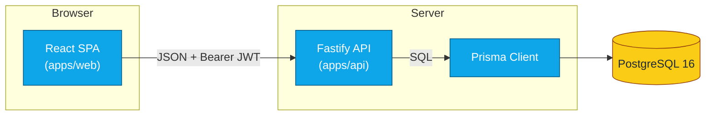

# Central IT Planner

> A self-hosted project management web app for teams that work in **Epics → Features → User Stories → Tasks**. Type-safe end-to-end (Zod ⇆ TypeScript), JWT-authenticated, multi-tenant via project memberships.

---

## Why this project

Most lightweight planners flatten work into a single layer of "tickets". Central IT Planner keeps the four-level hierarchy as a first-class concept in the data model and enforces it at the API layer, so a Task can never accidentally become the parent of an Epic. It is small enough to read end-to-end and opinionated enough to ship.

## Stack

| Layer    | Tech                                                                                                  |
| -------- | ----------------------------------------------------------------------------------------------------- |
| API      | [Fastify 5](https://fastify.dev) + TypeScript + [Prisma 6](https://www.prisma.io) + Zod (`apps/api`)  |
| Web      | [Vite](https://vitejs.dev) + React 18 + TypeScript + Tailwind + Radix + TanStack Query (`apps/web`)   |
| Shared   | Cross-cutting Zod schemas + TS types (`packages/shared`)                                              |
| Database | PostgreSQL 16 (via Docker Compose)                                                                    |
| Monorepo | [pnpm workspaces](https://pnpm.io/workspaces) (Node ≥ 20, pnpm ≥ 9)                                   |
| Auth     | `@fastify/jwt` (Bearer), bcrypt password hashing                                                      |
| Security | Helmet, strict CORS allow-list, project-scoped authorization (CEN-14 / CEN-20 / CEN-21)               |
| Docs     | OpenAPI 3 served at `/docs` via `@fastify/swagger-ui`                                                 |

## Architecture overview



For the data model and request-level sequence diagrams (create / move work item), see [docs/architecture.md](docs/architecture.md).

## Quickstart

```bash
# 1. Install dependencies (Node ≥ 20, pnpm ≥ 9)
pnpm install

# 2. Start Postgres
docker compose up -d postgres

# 3. Configure the API
cp apps/api/.env.example apps/api/.env
# - set JWT_SECRET to a value ≥32 chars (e.g. `openssl rand -base64 48`)
# - set CORS_ORIGIN to your web origin, e.g. http://localhost:5173

# 4. Run migrations + seed demo data
pnpm --filter @centralit/api db:migrate
pnpm --filter @centralit/api db:seed

# 5. Boot both apps (separate terminals)
pnpm --filter @centralit/api dev   # http://localhost:3001  •  docs at /docs
pnpm --filter @centralit/web dev   # http://localhost:5173
```

Full setup, env-var, and testing details live in [docs/dev-setup.md](docs/dev-setup.md).

## Screenshots

<!--
  TODO(CEN-15): replace these placeholders once the UI from CEN-13 lands.
  CEN-15 reverse-blocks on this child's merge to incorporate them.
-->

| View                | Status                  |
| ------------------- | ----------------------- |
| Project board       | _placeholder — CEN-15_  |
| Work item hierarchy | _placeholder — CEN-15_  |
| Login / register    | _placeholder — CEN-15_  |

> Screenshots are intentionally omitted until the UI (CEN-13) is delivered. CEN-15 reverse-blocks this child to incorporate them.

## Repository layout

```
.
├── apps/
│   ├── api/        # Fastify + Prisma backend (REST + OpenAPI)
│   └── web/        # Vite + React frontend (Tailwind + Radix)
├── packages/
│   └── shared/     # Zod schemas + TypeScript types shared by api/web
├── design/         # Static design assets (tokens, mockups)
├── security/       # Threat model + review notes (CEN-14)
├── docs/           # API reference, architecture, dev setup
├── docker-compose.yml
└── pnpm-workspace.yaml
```

## Workspace scripts

Run from the repo root:

| Command             | Effect                                   |
| ------------------- | ---------------------------------------- |
| `pnpm build`        | Build every workspace (api, web, shared) |
| `pnpm lint`         | ESLint across every workspace            |
| `pnpm typecheck`    | `tsc --noEmit` across every workspace    |
| `pnpm format`       | Prettier write                           |
| `pnpm format:check` | Prettier check (CI mode)                 |

API-only:

```bash
pnpm --filter @centralit/api dev          # tsx watch
pnpm --filter @centralit/api test         # vitest run
pnpm --filter @centralit/api db:migrate   # prisma migrate dev
pnpm --filter @centralit/api db:seed      # demo data
pnpm --filter @centralit/api db:studio    # Prisma Studio
```

Web-only:

```bash
pnpm --filter @centralit/web dev          # Vite dev server
pnpm --filter @centralit/web build        # tsc + vite build
pnpm --filter @centralit/web storybook    # design system playground
```

## Documentation

- [docs/api.md](docs/api.md) — REST reference (auth, projects, work items)
- [docs/architecture.md](docs/architecture.md) — data model + sequence diagrams
- [docs/dev-setup.md](docs/dev-setup.md) — env vars, Postgres, seeding, testing
- [CONTRIBUTING.md](CONTRIBUTING.md) — branch / commit / PR conventions
- `/docs` (running API) — interactive OpenAPI/Swagger UI

## License

Internal — Central IT. All rights reserved.
