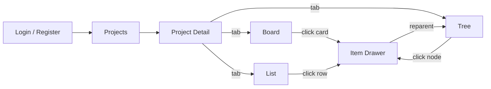
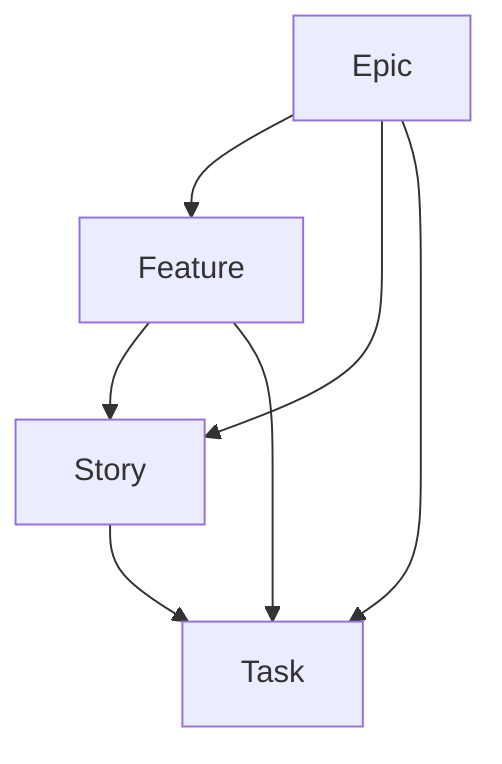
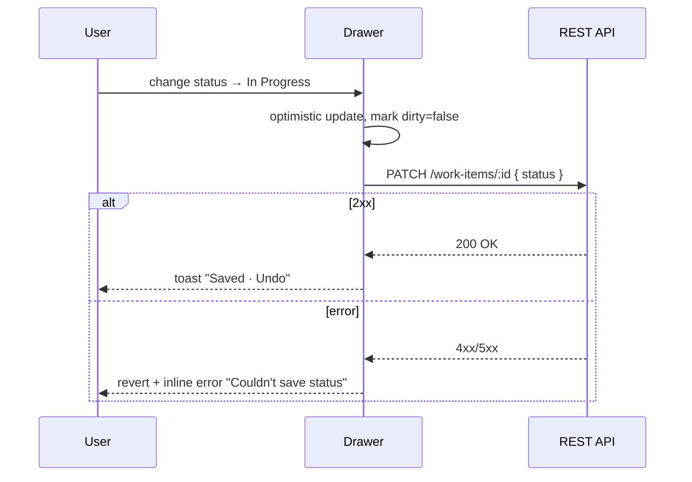

# Planner — Wireframes & UX Specification

**Issue:** [CEN-9](/CEN/issues/CEN-9) · **Parent:** [CEN-7](/CEN/issues/CEN-7) · **Consumers:** [CEN-12](/CEN/issues/CEN-12), [CEN-13](/CEN/issues/CEN-13)
**References:** Microsoft Planner, Trello, Azure DevOps Boards
**Companion:** [`design/tokens.json`](./tokens.json)

> Wireframes are intentionally low-fi (ASCII + Mermaid). All sizes, colors, spacing and shadows are normative and reference tokens in `design/tokens.json`. Engineers MUST map every concrete value through the token layer — do not hard-code hex/px in components.

---

## 0. Information Architecture



**Routes**

| Route | Screen | Auth |
|---|---|---|
| `/login` | Login | public |
| `/register` | Register | public |
| `/projects` | Project list | required |
| `/projects/:projectKey` | Project detail (default Board) | required |
| `/projects/:projectKey/board` | Board tab | required |
| `/projects/:projectKey/tree` | Tree tab | required |
| `/projects/:projectKey/list` | List tab | required |
| `/projects/:projectKey/items/:itemId` | Drawer open over current tab | required |

The drawer is a route — `?item=:itemId` query param is acceptable as fallback. Closing returns to the underlying tab without losing scroll/filter state.

---

## 1. Global Shell

```
┌───────────────────────────────────────────────────────────────────────┐
│  [P] Planner   ▸ Projects  ▸ Acme Web Redesign     🔍 search…  🔔 ⓘ AB │  ← TopBar h=56 · shadow.sm
├──────────────────────────────────────────────────────────────────────│
│  ┌── Sidebar (240) ──┐  ┌── Content ───────────────────────────────┐  │
│  │ 📋 Projects        │  │                                          │  │
│  │ ⭐ Starred         │  │  …screen content…                        │  │
│  │ 👥 People          │  │                                          │  │
│  │ ⚙  Settings       │  │                                          │  │
│  └────────────────────┘  └──────────────────────────────────────────┘  │
└───────────────────────────────────────────────────────────────────────┘
```

- **TopBar**: height `56px`, `bg=neutral.0`, `border-bottom=border.subtle`, `shadow.sm`. Contains breadcrumb, global search (⌘K), notifications, user menu.
- **Sidebar**: `width=240px`, collapsible to `64px` (icons only) below `breakpoints.lg`. `bg=neutral.50`, `border-right=border.subtle`.
- **Content**: max-width container at `breakpoints.xl`; tabs/filters live inside.
- **Empty/Error/Loading**: every primary surface has all three states (see §8).

---

## 2. Auth — Login & Register

### 2.1 Login

```
┌──────────────────────── 1440 × 900 ────────────────────────┐
│                                                            │
│                      [P]  Planner                          │  ← logo + wordmark (h2)
│                                                            │
│           ┌─────────────────────────────────────┐          │
│           │  Sign in                            │  h1      │
│           │  Welcome back. Pick up where you    │  body    │
│           │  left off.                          │          │
│           │                                     │          │
│           │  Email                              │  label   │
│           │  ┌─────────────────────────────┐    │  input   │
│           │  │ you@company.com             │    │          │
│           │  └─────────────────────────────┘    │          │
│           │  Password               👁          │  label   │
│           │  ┌─────────────────────────────┐    │          │
│           │  │ ••••••••                    │    │          │
│           │  └─────────────────────────────┘    │          │
│           │                  Forgot password?   │  link    │
│           │  ┌─────────────────────────────┐    │          │
│           │  │         Sign in   →         │    │ btn-pri  │
│           │  └─────────────────────────────┘    │          │
│           │  ─────────  or  ─────────           │          │
│           │  No account? Create one →           │  link    │
│           └─────────────────────────────────────┘          │
│                                                            │
│             © 2026 CentralIT · Terms · Privacy             │  caption
└────────────────────────────────────────────────────────────┘
```

- Card: `width=400px`, `padding=spacing.6`, `radius=radius.lg`, `shadow=shadow.md`, `bg=surface.raised`.
- Inputs: `components.input` tokens; show inline error with `color.semantic.danger.500` + helper text below.
- Primary button: full-width, `components.button.heightLg`, `bg=color.brand.500`, `fg=text.onBrand`, hover → `brand.600`, focus ring → `shadow.focus`.
- Loading: button shows spinner + text "Signing in…", disabled state. No double-submit.
- Errors (auth fail): banner above form, `bg=danger.50`, `fg=danger.700`, dismissible.

### 2.2 Register

Same card layout, adds **Name** field above email; password has strength meter (`weak/ok/strong` segments using `danger/warning/success.500`). Submit returns to `/projects` and toasts success.

### 2.3 Field-level rules (handoff)

| Field | Rule | Error copy |
|---|---|---|
| Email | RFC-5322, lowercased | "Enter a valid email." |
| Password (register) | ≥ 12 chars, 1 letter + 1 digit | "Use 12+ characters with a letter and a number." |
| Password (login) | non-empty | "Enter your password." |
| Name | 1–80 chars | "Name is required." |

Accessibility: every input has a `<label>` (not placeholder-as-label); errors are announced via `aria-describedby`. Tab order: name → email → password → submit.

---

## 3. Project List

```
┌──────────────────────────────────────────────────────────────────────┐
│ Projects                                              [+ New project] │
│ ──────────────────────────────────────────────────────────────────── │
│ 🔍 Search projects…                Sort: Recent ▾   View: Cards ▣ ≡ │
│                                                                      │
│ ┌────── Card ──────┐  ┌────── Card ──────┐  ┌────── Card ──────┐    │
│ │ ⭐ Acme Redesign │  │    Mobile App    │  │   Data Platform  │    │
│ │ 24 items · 5 ep. │  │ 12 items · 2 ep. │  │ 81 items · 9 ep. │    │
│ │ ▓▓▓▓▓░░░░ 52%    │  │ ▓▓▓░░░░░░ 28%    │  │ ▓▓▓▓▓▓▓▓░ 88%    │    │
│ │ AB · CD · EF +2  │  │ AB · GH          │  │ EF · IJ · KL +4  │    │
│ └──────────────────┘  └──────────────────┘  └──────────────────┘    │
│                                                                      │
│ ┌─── empty state when 0 projects ───┐                                │
│ │ 📁  No projects yet                │                                │
│ │ Create your first project to       │                                │
│ │ organize epics, features, stories  │                                │
│ │ and tasks.                         │                                │
│ │ [+ New project]                    │                                │
│ └────────────────────────────────────┘                                │
└──────────────────────────────────────────────────────────────────────┘
```

- Card: `width=320`, `padding=spacing.4`, `radius=radius.md`, `shadow=shadow.sm` → `shadow.md` on hover, `border-left=3px solid color.brand.500` for starred.
- Progress bar: `height=4px`, `bg=neutral.100`, fill `brand.500`.
- Avatars: `24px`, overlap `-spacing.1`; "+N" chip when >3.
- Grid: `repeat(auto-fill, minmax(280px, 1fr))`, `gap=spacing.4`.
- "New project" → modal with **Name** + **Key (auto-derived)** + **Description**.

---

## 4. Project Detail

```
┌──────────────────────────────────────────────────────────────────────┐
│ Acme Web Redesign · ACME           [+ New item ▾]   ⓘ Members   ⚙   │  header h=72
│ ┌── Tabs ──────────────────────────────────────────────────────────┐ │
│ │  Board  │  Tree  │  List  │  Insights                            │ │
│ └──────────────────────────────────────────────────────────────────┘ │
│ ┌── Filter Bar (sticky, h=48) ─────────────────────────────────────┐ │
│ │ Type: [All ▾] [Epic][Feature][Story][Task]   Priority [All ▾]    │ │
│ │ Assignee [Anyone ▾]  Status [All ▾]  Query 🔍   Group: Status ▾  │ │
│ └──────────────────────────────────────────────────────────────────┘ │
│ ┌── Tab content (Board | Tree | List) ─────────────────────────────┐ │
│ │   …see §5 / §6 / §7…                                              │ │
│ └──────────────────────────────────────────────────────────────────┘ │
└──────────────────────────────────────────────────────────────────────┘
```

- **+ New item** is a split button → menu `Epic / Feature / Story / Task`. Type pre-fills the drawer.
- Filter bar persists per project in `localStorage`; resets per user, never per session.
- Type chips are multi-select (toggle), use `color.type.*` tokens. Active chip → filled; inactive → outlined.

---

## 5. Board View (Kanban by Status)

```
┌── Filter Bar (above) ───────────────────────────────────────────────┐
└──────────────────────────────────────────────────────────────────────┘
┌─────────────┬─────────────┬─────────────┬─────────────┬─────────────┐
│ Backlog (8) │ To Do (5)   │ In Prog (3) │ Review (2)  │ Done (14)   │  ← column header sticky
│ + Add card  │ + Add card  │ + Add card  │ + Add card  │ + Add card  │
├─────────────┼─────────────┼─────────────┼─────────────┼─────────────┤
│ ┌─────────┐ │ ┌─────────┐ │ ┌─────────┐ │ ┌─────────┐ │ ┌─────────┐ │
│ │█ EPIC   │ │ │█ FEATURE│ │ │█ STORY  │ │ │█ TASK   │ │ │█ STORY  │ │
│ │Checkout │ │ │Cart UX  │ │ │As a usr…│ │ │Wire SSO │ │ │Login fmt│ │
│ │redesign │ │ │refresh  │ │ │…I can…  │ │ │endpoint │ │ │polish   │ │
│ │ACME-12  │ │ │ACME-34  │ │ │ACME-77  │ │ │ACME-91  │ │ │ACME-22  │ │
│ │● High   │ │ │● Med    │ │ │● Med    │ │ │● Crit   │ │ │● Low    │ │
│ │👥 AB CD │ │ │👥 EF    │ │ │👥 AB    │ │ │👥 GH IJ │ │ │👥 KL    │ │
│ │↳ 4 sub  │ │ │↳ 2 sub  │ │ │↳ 6 sub  │ │ │         │ │ │         │ │
│ └─────────┘ │ └─────────┘ │ └─────────┘ │ └─────────┘ │ └─────────┘ │
│ ┌─────────┐ │ ┌─────────┐ │             │             │             │
│ │ …       │ │ │ …       │ │             │             │             │
│ └─────────┘ │ └─────────┘ │             │             │             │
└─────────────┴─────────────┴─────────────┴─────────────┴─────────────┘
                                                  (horizontal scroll →)
```

**Column (`components.column`)**
- Width `320px` fixed; gap `spacing.3`; column body scrolls vertically; row of columns scrolls horizontally.
- Header sticky at top with title, count chip (`components.chip`), `+ Add card` quick-add.
- Empty column shows a soft dashed drop target ("Drop here to set status: To Do").

**Card (`components.card`)**
- Padding `spacing.4`, radius `radius.md`, shadow `shadow.sm`; hover → `shadow.md`; while dragging → `shadow.drag` + `rotate(2deg)`.
- `border-left: 3px solid color.type.<type>.bg` — the only place type color is required for a11y (chip below repeats it).
- Type chip (top-left), priority dot (`color.priority.*`), identifier `ACME-12` `caption mono`.
- Title `body` 2-line clamp; description never shown on card.
- Footer: assignee avatars (max 3 + "+N"), subitem count, due-date pill if set.

**Drag & Drop**
- `react-dnd` HTML5 backend; touch via `react-dnd-touch-backend` below `md`.
- Drop targets: column body (= change status), card (= reorder within column).
- Reparenting (epic→feature, etc.) is NOT done on the board — it's a drawer action (§7).
- On drop: optimistic update, toast "Moved to In Progress" with **Undo**.
- Keyboard DnD: focus card → `Space` lifts, ←/→ moves column, ↑/↓ moves position, `Space` drops, `Esc` cancels. Announce all moves via `aria-live=polite`.

**Type filter chips (above)**
```
[ Epic ●12 ]  [ Feature ●24 ]  [ Story ●41 ]  [ Task ●86 ]    Clear ✕
```
Counts reflect currently-loaded set. Click → AND filter; Shift+click → OR; chips persist in URL.

**Loading**: skeleton cards (3 per column) using `neutral.100` shimmer.
**Error**: column-level inline error with **Retry**; never collapses the board.
**Empty (no items)**: large empty state in the center with **+ New item** primary action.

---

## 6. Hierarchy Tree View

```
┌──────────────────────────────────────────────────────────────────────┐
│ ▾ █ EPIC  Checkout redesign · ACME-12 · 🟡 In Progress · ● High      │
│     ▾ █ FEATURE  Cart UX refresh · ACME-34 · 🟡 In Progress · ● Med  │
│         ▾ █ STORY  As a buyer, I can edit qty · ACME-77 · 🔵 To Do   │
│             • █ TASK  Wire quantity stepper · ACME-78 · ⚪ Backlog    │
│             • █ TASK  Update cart API call  · ACME-79 · ⚪ Backlog    │
│         ▸ █ STORY  As a buyer, I can remove items · ACME-80          │
│     ▸ █ FEATURE  Saved carts · ACME-50                               │
│ ▸ █ EPIC  Account refresh · ACME-90                                  │
│ ▸ █ EPIC  Search overhaul · ACME-100                                 │
└──────────────────────────────────────────────────────────────────────┘
```

- Indent `spacing.6` per level; chevron `▸/▾` is the disclosure control.
- Type pill on every row (4-letter, mono, `color.type.*`).
- Status badge uses `color.status.*` chip; priority dot uses `color.priority.*`.
- Right-side toolbar per row (visible on hover): `↳ Reparent`, `+ Child`, `…`.
- **Drag-to-reparent** rules enforced client-side and on API:
  - `TASK.parent ∈ {STORY, FEATURE, EPIC, null}`
  - `STORY.parent ∈ {FEATURE, EPIC, null}`
  - `FEATURE.parent ∈ {EPIC, null}`
  - `EPIC.parent = null`
- Invalid drop targets get red outline + `cursor: not-allowed` + tooltip "Tasks can't parent a Story".
- Keyboard: `←` collapse, `→` expand, `↑/↓` move focus, `Enter` open drawer, `M` reparent (opens picker).
- Virtualized list (`@tanstack/react-virtual`) for projects > 200 items.



---

## 7. Item Drawer (CRUD + Reparent)

```
                                  ┌────────── Drawer (560) ──────────┐
                                  │  █ STORY · ACME-77  ✎ rename   ✕ │  h=64
                                  │  ─────────────────────────────── │
                                  │  As a buyer, I can edit quantity │  h1 (inline edit)
                                  │  in the cart                      │
                                  │  ─────────────────────────────── │
                                  │  Status   [ To Do        ▾ ]      │
                                  │  Priority [ Medium       ▾ ]      │
                                  │  Assignee [ AB · Alice B ▾ ]      │
                                  │  Parent   [ FEATURE · Cart UX ↗ ] │  ← click=Reparent
                                  │  Type     [ Story        ▾ ]      │  ← change cascades
                                  │  Estimate [ 3 pts        ▾ ]      │
                                  │  Due date [ 2026-06-12   📅 ]     │
                                  │  ─────────────────────────────── │
                                  │  Description                      │
                                  │  ┌─────────────────────────────┐ │
                                  │  │ Markdown editor             │ │
                                  │  │ - Acceptance criteria       │ │
                                  │  │ - Notes …                   │ │
                                  │  └─────────────────────────────┘ │
                                  │  ─────────────────────────────── │
                                  │  Children (4)            + Add   │
                                  │  • TASK Wire quantity stepper    │
                                  │  • TASK Update cart API call     │
                                  │  • TASK QA flow                  │
                                  │  • TASK Telemetry                │
                                  │  ─────────────────────────────── │
                                  │  Activity                         │
                                  │  AB moved To Do → In Progress  2m │
                                  │  CD created TASK ACME-79      14m │
                                  │  ─────────────────────────────── │
                                  │  [ 💬 Add a comment…           ] │
                                  │  ─────────────────────────────── │
                                  │  ⚠ Delete            [Cancel][Save]│  footer sticky
                                  └───────────────────────────────────┘
```

**Behavior**
- Slide-in from right, `width=min(560px, 100vw)`, `bg=surface.drawer`, `shadow=shadow.xl`, scrim `surface.overlay`.
- Opens via URL → deep-linkable. `Esc` closes; outside click closes with unsaved-changes confirm.
- Field-level autosave on blur for low-risk fields (status, priority, assignee, due date) — toast "Saved" with undo.
- Title + description require explicit **Save** (header shows `● Unsaved` dot).
- **Reparent**: opens a hierarchical picker (same tree as §6) scoped to valid parent types for the current `type`. Empty option = "No parent (top-level)".
- **Type change** is validated against current parent/children and surfaces what will break before confirm.
- **Delete**: requires typing the identifier (e.g., `ACME-77`) to confirm; cascades children with a checkbox "Also delete N children" (default: false; if false and children exist, deletion is blocked).

**A11y / UX**
- Focus trap inside drawer; first focus on title field if newly created, otherwise on the close button.
- All comboboxes are keyboard-friendly (`role="combobox"`, `aria-expanded`, `↑/↓/Enter`).
- Optimistic mutations everywhere; failure → revert + inline error.

**Create flow**
- Same drawer, `identifier` shows `…` until backend returns it; URL becomes canonical post-save.
- Required: `title`, `type`, `status` (default `BACKLOG`). All else optional.



---

## 8. Cross-cutting states

Every primary surface defines four states. Engineers MUST implement all four.

| State | Visual | Token |
|---|---|---|
| Loading | skeleton blocks, shimmer | `neutral.100` → `neutral.200`, `motion.duration.slow` |
| Empty | icon + heading + body + primary CTA | `text.secondary` body, `brand.500` CTA |
| Error | banner with retry / inline message | `danger.50` bg, `danger.700` fg, `border.danger` |
| Success (post-mutation) | toast top-right, 4s, dismissible | `success.50` bg, `success.700` fg, `shadow.lg` |

**Toast positions:** top-right desktop, top-center mobile.
**Snackbar with Undo** is preferred over modal confirms for reversible actions (status change, delete with grace).

---

## 9. Responsive behavior

| Breakpoint | Behavior |
|---|---|
| `< sm` (≤640) | Sidebar collapses to a slide-out. Board: single column at a time with swipe + sticky column picker chip. Drawer = full screen sheet. |
| `sm–md` | Sidebar icons only. Board: 2 columns visible, horizontal scroll. |
| `md–lg` | Sidebar expanded optional. Board: 3 columns visible. |
| `lg+` | Default desktop layout (all 5+ columns). |

Filter bar collapses overflow into a "+ Filters" popover when narrower than its natural width.

---

## 10. Accessibility (first-class)

- WCAG 2.2 AA across all surfaces.
- Color is never the only carrier of meaning — type uses chip + border + label; status uses chip + label; priority uses dot + label.
- Focus ring: `2px` outline + `shadow.focus`; never `outline: none` without an equivalent.
- All interactive elements reachable by keyboard, in DOM order matching visual order.
- Skip-to-content link in TopBar (visible on focus).
- Reduced motion: `@media (prefers-reduced-motion: reduce)` disables card lift and drawer slide; cross-fade only.
- Dark mode uses `color.dark.*` token group; contrast verified at the same AA threshold.

---

## 11. Component → Token map (handoff)

| Component | Tokens (must use) |
|---|---|
| `Button.primary` | `color.brand.500/.600`, `text.onBrand`, `components.button.*`, `radius.md`, `shadow.focus` |
| `Button.secondary` | `neutral.0` bg, `border.default`, `text.primary`, hover `neutral.50` |
| `Input` | `components.input.*`, `border.default → border.focus`, `radius.md` |
| `Card` (board) | `components.card.*`, `color.type.<t>.bg` for left border |
| `Chip` (type/status/priority) | `color.type.*`, `color.status.*`, `color.priority.*` |
| `Column` | `components.column.*`, `surface.column` |
| `Drawer` | `components.drawer.*`, `surface.drawer`, `surface.overlay` |
| `Tabs` | underline `brand.500`, inactive `text.secondary` |
| `Avatar` | `radius.pill`, size 24/32/40, ring `border.subtle` |
| `Toast` | bg per semantic, `shadow.lg`, `radius.md` |

---

## 12. Acceptance criteria for consuming issues

**[CEN-12](/CEN/issues/CEN-12) — frontend scaffold:**
- Tailwind config (or CSS variables) derived from `design/tokens.json` (no inline hex).
- Component primitives wired (Button, Input, Card, Chip, Drawer, Toast) matching §11.
- Routes from §0 with auth guard.
- Light + dark themes both pass AA on key surfaces.

**[CEN-13](/CEN/issues/CEN-13) — hierarchy UI:**
- Board, Tree, List tabs with sticky filter bar.
- Drag-and-drop on board (mouse + keyboard) per §5.
- Drag-to-reparent in tree with valid-parent enforcement per §6.
- Drawer per §7 including reparent picker and delete confirmation.
- All four cross-cutting states (§8) implemented per surface.

---

## 13. Open questions (flag back to PM)

1. **Multi-tenancy**: are projects org-scoped or user-scoped? Affects sidebar and breadcrumb.
2. **Real-time**: is Phase 1 single-user with manual refresh, or do we need websockets/SSE for board updates?
3. **File attachments on items** — in scope for v0.1.0 or v0.2?
4. **Comments on items** — drawer shows the affordance; backend must expose it (currently not in [CEN-10](/CEN/issues/CEN-10) schema).
5. **Roles/permissions** — do non-creator users have edit rights on items they didn't author?

Will not block on these — defaulting to: org-scoped projects, polling refresh (10s), no attachments in v0.1, comments in v0.2, all members edit. Confirm in [CEN-7](/CEN/issues/CEN-7) thread.
