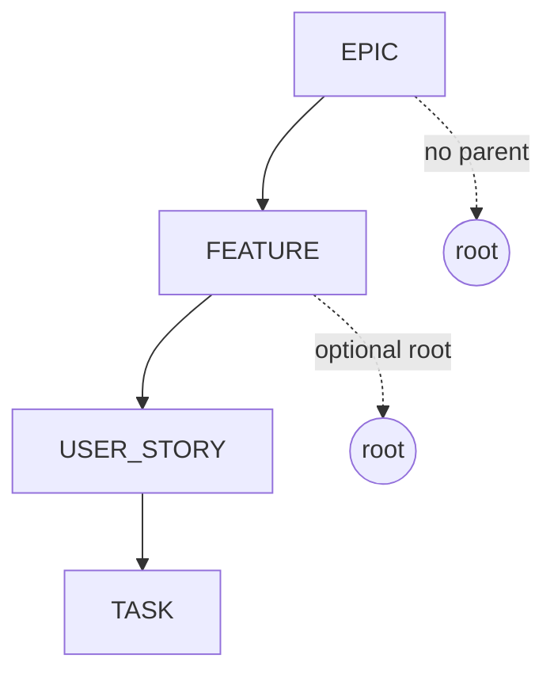

# API Reference

REST API exposed by `apps/api`. JSON in, JSON out. All non-system routes require a Bearer JWT obtained from `POST /auth/login` or `POST /auth/register`.

> The same definitions are served as live OpenAPI 3 + interactive Swagger UI at **`http://localhost:3001/docs`** when the API is running. This document is a human-readable companion.

---

## Conventions

- **Base URL:** `http://localhost:3001` in dev. No global `/api` prefix — routes are mounted directly.
- **Auth:** every protected route requires `Authorization: Bearer <jwt>`. The token is signed with `JWT_SECRET` (HS256) and expires per `JWT_EXPIRES_IN` (default `7d`).
- **Content type:** `application/json` for requests with a body.
- **IDs:** UUID v4 strings.
- **Timestamps:** ISO-8601 strings (`createdAt`, `updatedAt`).
- **Request correlation:** every response includes an `x-request-id` header (echo of inbound `x-request-id` when ≤127 chars, otherwise a fresh UUID). Errors include `requestId` in the body.
- **Authorization model:** access to a project (and everything inside it) is governed by `ProjectMembership.role`:

  | Role     | Read project | Write items | Update project | Delete project |
  | -------- | :----------: | :---------: | :------------: | :------------: |
  | `READER` |      ✅      |     ❌      |       ❌       |       ❌       |
  | `WRITER` |      ✅      |     ✅      |       ✅       |       ❌       |
  | `OWNER`  |      ✅      |     ✅      |       ✅       |       ✅       |

  Creating a project automatically grants the caller the `OWNER` role on it.

## Error envelope

All non-2xx responses share the same shape:

```json
{
  "error": {
    "code": "BAD_REQUEST",
    "message": "Validation failed",
    "details": []
  },
  "requestId": "f1c5d3..."
}
```

| Status | `error.code`   | Cause                                                                                                  |
| -----: | -------------- | ------------------------------------------------------------------------------------------------------ |
|    400 | `BAD_REQUEST`  | Body/query/path failed Zod validation or domain rule (e.g. invalid parent type, cross-project parent). |
|    401 | `UNAUTHORIZED` | Missing/invalid JWT, or invalid credentials.                                                           |
|    403 | `FORBIDDEN`    | Caller lacks the required project role.                                                                |
|    404 | `NOT_FOUND`    | Resource does not exist or is not visible to the caller.                                               |
|    409 | `CONFLICT`     | Unique constraint (e.g. duplicate `email`, duplicate `Project.key`).                                   |
|    500 | `INTERNAL`     | Unhandled error (look up `requestId` in API logs).                                                     |

---

## System

### `GET /health`

Liveness probe. No auth.

```json
{
  "status": "ok",
  "service": "centralit-planner-api",
  "timestamp": "2026-05-22T18:30:00.000Z"
}
```

### `GET /docs`

Swagger UI. The raw OpenAPI document is at `/docs/json` and `/docs/yaml`.

---

## Auth

### `POST /auth/register`

Create a new user and return a JWT.

```http
POST /auth/register
Content-Type: application/json

{
  "email": "ada@example.com",
  "password": "correct horse battery staple",
  "name": "Ada Lovelace"
}
```

- **201**: `{ token, user }` — see [User shape](#user).
- **400**: validation failure (email format, password ≥ 8 chars, name length).
- **409**: email already registered.

### `POST /auth/login`

Exchange credentials for a JWT.

```http
POST /auth/login
Content-Type: application/json

{ "email": "ada@example.com", "password": "correct horse battery staple" }
```

- **200**: `{ token, user }`.
- **401**: `UNAUTHORIZED` — invalid credentials (same message for unknown email and wrong password to avoid user enumeration).

### `GET /auth/me`

Return the current user. Requires `Authorization: Bearer <jwt>`.

- **200**: [User](#user).
- **401**: missing/invalid token.
- **404**: token references a user that no longer exists.

#### User

```json
{
  "id": "5e3c...uuid",
  "email": "ada@example.com",
  "name": "Ada Lovelace",
  "createdAt": "2026-05-22T18:30:00.000Z"
}
```

---

## Projects

All routes require auth. Visibility is scoped to projects where the caller has a `ProjectMembership`.

### `GET /projects`

List projects the caller is a member of.

- **200**:

  ```json
  {
    "items": [
      {
        "id": "5e3c...uuid",
        "key": "ACME",
        "name": "Acme Web Redesign",
        "description": "Demo project seeded for development.",
        "createdAt": "...",
        "updatedAt": "..."
      }
    ],
    "total": 1
  }
  ```

### `POST /projects`

Create a project. The caller becomes its `OWNER`.

```json
{
  "key": "ACME",
  "name": "Acme Web Redesign",
  "description": "Optional."
}
```

- `key`: 2–10 chars, `^[A-Z][A-Z0-9]+$` (uppercase letters + digits, starts with a letter).
- **201**: created project.
- **400**: validation failure.
- **409**: `key` already in use.

### `GET /projects/{id}`

Read a project. Requires `READER` on it.

- **200**: project.
- **403**: caller is not a member.
- **404**: not found.

### `PATCH /projects/{id}`

Update name and/or description. Requires `WRITER`.

```json
{ "name": "Acme Redesign 2.0", "description": null }
```

- Either field may be omitted. `description: null` clears it.
- **200**: updated project.
- **403**: caller lacks `WRITER`.
- **404**: not found.

### `DELETE /projects/{id}`

Delete a project (cascades to memberships and work items). Requires `OWNER`.

- **204**: deleted.
- **403**: caller is not `OWNER`.
- **404**: not found.

---

## Work items

All routes require auth. Authorization is enforced via the work item's project: `READER` for reads, `WRITER` for writes.

### Hierarchy rules

A `WorkItem` has a `kind` and an optional `parentId`. The allowed parent shape is:



| Kind      | Allowed parent kind             |
| --------- | ------------------------------- |
| `epic`    | _none_ (always root)            |
| `feature` | `epic` or _none_                |
| `story`   | `feature` or `epic`             |
| `task`    | `story`, `feature`, or `epic`   |

Violations return **400** with `BAD_REQUEST`. The parent must also belong to the same project; cross-project reparenting returns **400**.

### `GET /work-items`

List work items the caller can see, scoped to their project memberships.

Query string (all optional):

| Field        | Type / values                                                                |
| ------------ | ---------------------------------------------------------------------------- |
| `projectId`  | UUID — restricts to one project (ignored if caller is not a member)          |
| `kind`       | `epic` \| `feature` \| `story` \| `task`                                     |
| `status`     | `backlog` \| `todo` \| `in_progress` \| `in_review` \| `done` \| `cancelled` |
| `priority`   | `critical` \| `high` \| `medium` \| `low`                                    |
| `parentId`   | UUID \| `null` (use `parentId=null` to find roots)                           |
| `assigneeId` | UUID \| `null`                                                               |
| `q`          | string 1–200 — case-insensitive substring on title/description               |
| `limit`      | integer 1–200, default `50`                                                  |
| `offset`     | integer ≥ 0, default `0`                                                     |

- **200**: `{ items: WorkItem[], total: number, limit, offset }`.

### `POST /work-items`

Create a work item. Requires `WRITER` on the target project.

```json
{
  "kind": "story",
  "title": "User can pay with PIX",
  "description": "Optional.",
  "status": "todo",
  "priority": "medium",
  "projectId": "5e3c...uuid",
  "parentId": "ab21...uuid",
  "assigneeId": "0fbc...uuid",
  "attributes": { "estimatePoints": 5 }
}
```

- `status`, `priority`, `description`, `parentId`, `assigneeId`, `attributes` are optional.
- **201**: created work item.
- **400**: parent kind disallowed by hierarchy rules, parent in another project, or validation failure.
- **403**: caller lacks `WRITER` on `projectId`.
- **404**: `parentId` or `assigneeId` does not exist.

### `GET /work-items/{id}`

Read a work item. Requires `READER` on its project.

- **200**: work item.
- **403**: caller is not a project member.
- **404**: not found.

### `PATCH /work-items/{id}`

Update a work item. Requires `WRITER`.

Partial body — send only the fields you want to change. `description` and `assigneeId` accept `null` to clear.

```json
{
  "title": "User can pay with PIX (revised)",
  "status": "in_progress",
  "priority": "high",
  "assigneeId": null
}
```

- **200**: updated work item.
- **403** / **404** as above.

> To reparent, use `POST /work-items/{id}/move` — not `PATCH`. `parentId` is not editable via `PATCH`.

### `DELETE /work-items/{id}`

Delete a work item. Requires `WRITER`. Children are reparented to `null` (Prisma `onDelete: SetNull`).

- **204**: deleted.
- **403** / **404** as above.

### `POST /work-items/{id}/move`

Reparent a work item. Requires `WRITER` on its project.

```json
{ "parentId": "ab21...uuid" }
```

Or detach from any parent:

```json
{ "parentId": null }
```

Enforced invariants:

- Cannot be its own parent (`400`).
- New parent must live in the same project (`400`).
- New parent kind must satisfy the hierarchy rules above (`400`).

- **200**: updated work item.
- **403** / **404** as above.

### `WorkItem` shape

```json
{
  "id": "5e3c...uuid",
  "kind": "story",
  "title": "User can pay with PIX",
  "description": null,
  "status": "todo",
  "priority": "medium",
  "projectId": "5e3c...uuid",
  "parentId": "ab21...uuid",
  "assigneeId": null,
  "attributes": {},
  "createdAt": "2026-05-22T18:30:00.000Z",
  "updatedAt": "2026-05-22T18:30:00.000Z"
}
```

`attributes` is a free-form JSON object (`Json` column in Postgres) for fields that do not warrant first-class columns (e.g. story points, acceptance criteria).

---

## Worked example: end-to-end

```bash
# 1. Register
TOKEN=$(curl -s -XPOST http://localhost:3001/auth/register \
  -H 'content-type: application/json' \
  -d '{"email":"ada@example.com","password":"super-strong-pw","name":"Ada"}' \
  | jq -r .token)

# 2. Create a project (you become OWNER)
PROJECT=$(curl -s -XPOST http://localhost:3001/projects \
  -H "authorization: Bearer $TOKEN" -H 'content-type: application/json' \
  -d '{"key":"DEMO","name":"Demo"}' | jq -r .id)

# 3. Create an epic
EPIC=$(curl -s -XPOST http://localhost:3001/work-items \
  -H "authorization: Bearer $TOKEN" -H 'content-type: application/json' \
  -d "{\"kind\":\"epic\",\"title\":\"Onboarding\",\"projectId\":\"$PROJECT\"}" \
  | jq -r .id)

# 4. Create a feature under the epic
curl -s -XPOST http://localhost:3001/work-items \
  -H "authorization: Bearer $TOKEN" -H 'content-type: application/json' \
  -d "{\"kind\":\"feature\",\"title\":\"Email verification\",\"projectId\":\"$PROJECT\",\"parentId\":\"$EPIC\"}"
```

---

## Source of truth

This document is generated by hand and reviewed alongside the routes themselves. If it ever drifts from `apps/api/src/routes/*` or `packages/shared/src/index.ts`, **the code wins** — open a PR to bring this file back in sync (see [CONTRIBUTING.md](../CONTRIBUTING.md)).
