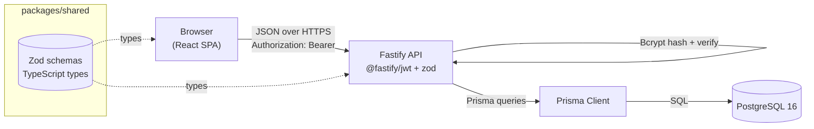
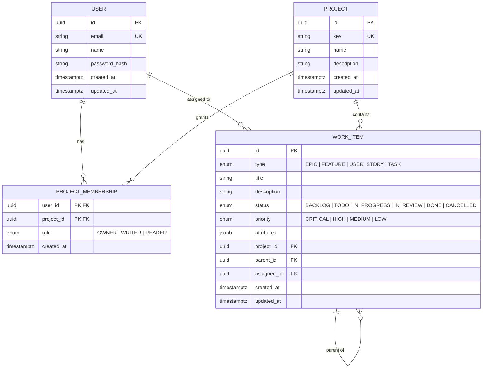
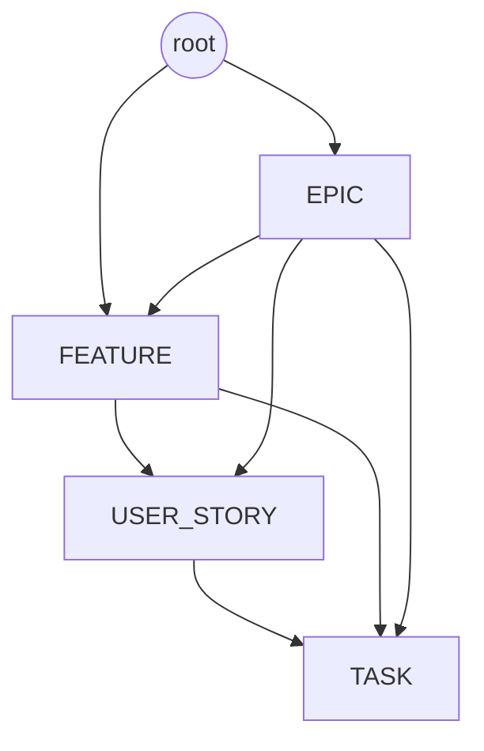
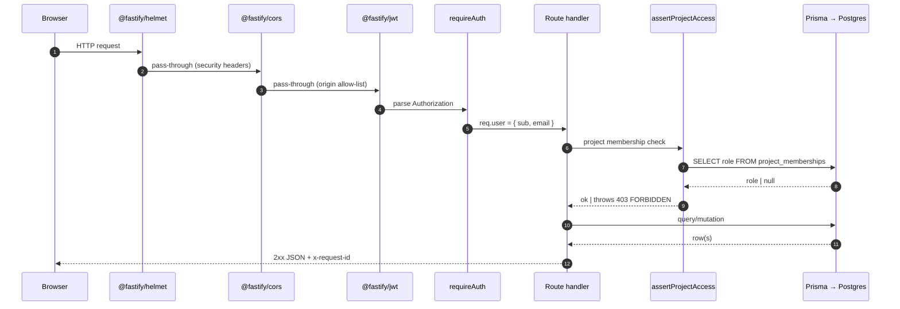
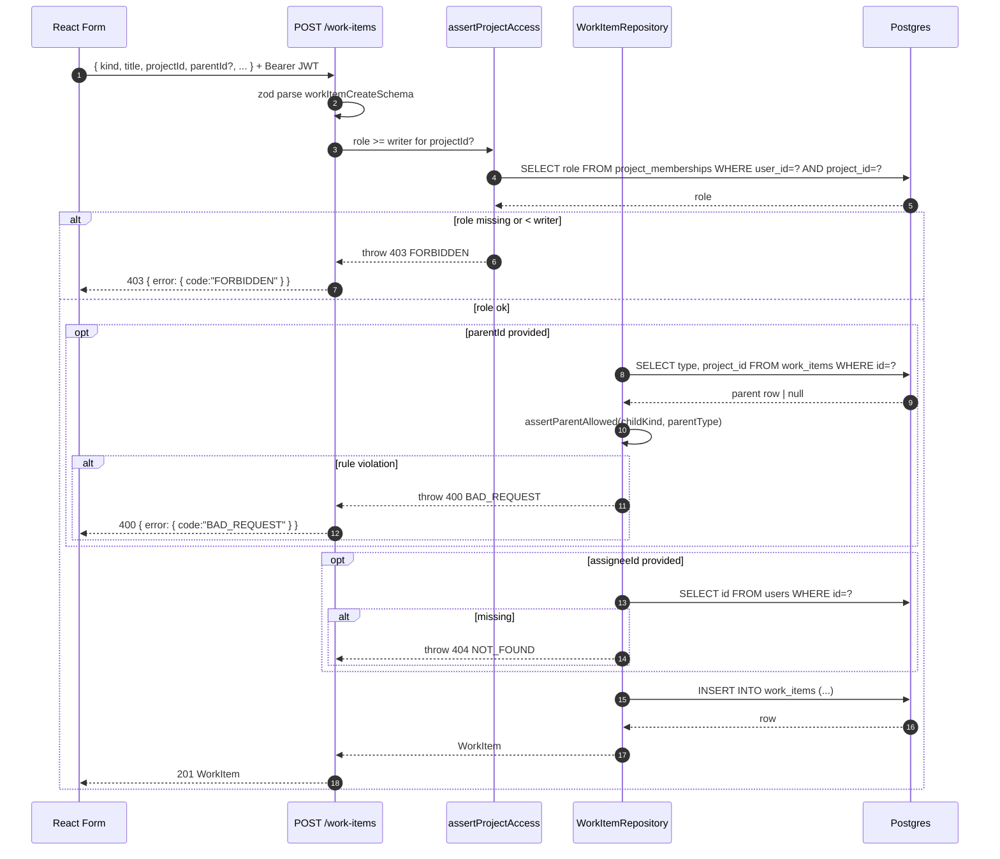
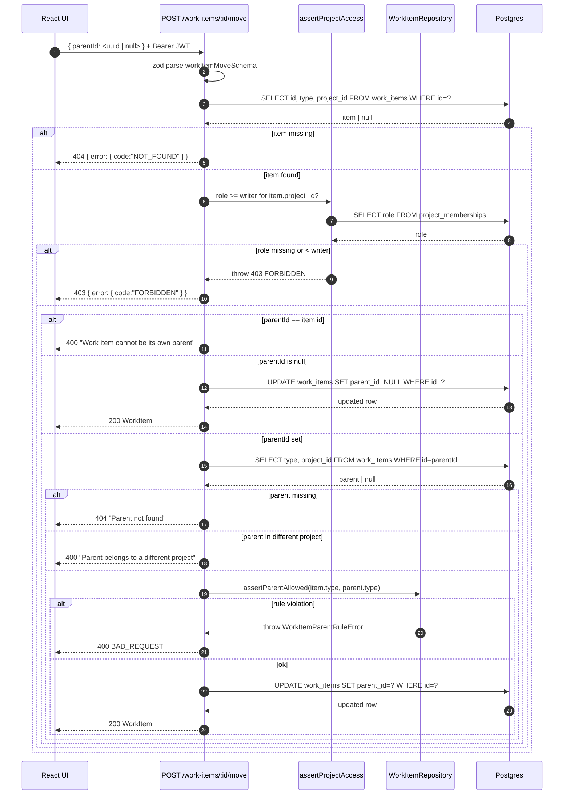

# Architecture

Central IT Planner is a small but opinionated three-tier system:

1. A **React SPA** (`apps/web`) talks to a single REST API.
2. A **Fastify API** (`apps/api`) enforces auth, validates payloads, and orchestrates database access.
3. **PostgreSQL 16** stores users, projects, memberships, and the polymorphic `work_items` table.

The shared **Zod schemas** in `packages/shared` are the single source of truth for request/response shapes — both the API (validation + OpenAPI generation) and the web client (forms + React Query) import the same `*Schema` definitions.

---

## System diagram

### Trust boundaries

- **Browser ↔ API:** authenticated by short-lived JWT in the `Authorization` header. CORS is a strict allow-list (no `*`); credentials are enabled. See `apps/api/src/app.ts` and `apps/api/src/env.ts`.
- **API ↔ DB:** single connection string in `DATABASE_URL`. Prisma is the only path into the database; raw SQL is restricted to migrations.
- **Object-level authorization:** every project-scoped read/write call funnels through `assertProjectAccess(...)` (`apps/api/src/lib/access.ts`), which checks the caller's `ProjectMembership.role`. This is the IDOR mitigation from CEN-21.

---

## Data model

Source of truth: `apps/api/prisma/schema.prisma` (the Prisma schema) and the SQL migrations in `apps/api/prisma/migrations/`.

### Why one polymorphic `work_items` table?

Epics, Features, Stories, and Tasks share 90% of their columns (title, status, priority, assignee, timestamps, project scope) and 100% of their lifecycle. Splitting them into four tables would require:

- Four sets of CRUD endpoints (or runtime dispatch on a discriminator anyway).
- Hand-written `UNION ALL` views for any cross-type list (kanban boards, search).
- Foreign keys per pair (Epic→Feature, Feature→Story, ...), or a polymorphic association with the same `CHECK`-constraint problem.

The single-table approach keeps queries trivial — one `WHERE type = ?` for filters, one self-referential `parent_id` for hierarchy — and the kind-specific rules (Task cannot parent an Epic) are enforced in code:

- Application-level enforcement: `apps/api/src/db/workItems.ts` → `assertParentAllowed()`.
- Database-level enforcement: a CHECK constraint added in the init SQL migration (Prisma does not model CHECKs natively).

### Hierarchy rules

| Child        | Allowed parents                  |
| ------------ | -------------------------------- |
| `EPIC`       | _none_ (root)                    |
| `FEATURE`    | `EPIC`, or no parent (root)      |
| `USER_STORY` | `FEATURE`, `EPIC`                |
| `TASK`       | `USER_STORY`, `FEATURE`, `EPIC`  |

The matrix lives in `apps/api/src/db/workItems.ts` (`VALID_PARENT_TYPES`). Any move/create that violates it throws `WorkItemParentRuleError`, which the route handlers translate to **HTTP 400** `BAD_REQUEST`.

### Project membership = the access boundary

A user can only see a project (and the work items inside it) if they have a `ProjectMembership` row. The role decides what they can do:

| Role     | List / read project & items | Create / update / delete items | Update project | Delete project |
| -------- | :-------------------------: | :----------------------------: | :------------: | :------------: |
| `READER` |             ✅              |               ❌               |       ❌       |       ❌       |
| `WRITER` |             ✅              |               ✅               |       ✅       |       ❌       |
| `OWNER`  |             ✅              |               ✅               |       ✅       |       ✅       |

Creating a project inserts a membership row with `role = OWNER` for the caller in the same transaction.

---

## Request lifecycle

Every error is translated by a single `setErrorHandler` (`apps/api/src/app.ts`) into the canonical envelope `{ error: { code, message, details }, requestId }`.

---

## Sequence: create a work item

Key invariants enforced at this step:

- `req.body` matches `workItemCreateSchema` (Zod).
- The caller has `WRITER` (or `OWNER`) on `projectId`.
- If `parentId` is set: the parent exists, belongs to the same project, and the (childKind, parentKind) pair is in `VALID_PARENT_TYPES`.
- If `assigneeId` is set: the user exists.

---

## Sequence: move (reparent) a work item

Reparenting deliberately uses a dedicated `POST /:id/move` endpoint instead of allowing `parentId` on `PATCH /:id`: it forces every reparent to go through the hierarchy + cross-tenant + self-loop checks above, which would otherwise be easy to skip.

---

## Where to look in the code

| Concern                                | Where                                                        |
| -------------------------------------- | ------------------------------------------------------------ |
| Schemas (request/response)             | `packages/shared/src/index.ts`                               |
| Fastify app + plugins + error handler  | `apps/api/src/app.ts`                                        |
| Boot + graceful shutdown               | `apps/api/src/server.ts`                                     |
| Env validation                         | `apps/api/src/env.ts`                                        |
| Routes                                 | `apps/api/src/routes/{auth,projects,workItems,health}.ts`    |
| Authorization helper                   | `apps/api/src/lib/access.ts`                                 |
| Hierarchy rules + repository           | `apps/api/src/db/workItems.ts`                               |
| Password hashing                       | `apps/api/src/lib/password.ts`                               |
| HTTP error class + factories           | `apps/api/src/lib/errors.ts`                                 |
| DB schema                              | `apps/api/prisma/schema.prisma`                              |
| SQL migrations                         | `apps/api/prisma/migrations/`                                |
| Seed data                              | `apps/api/prisma/seed.ts`                                    |
| Threat model + STRIDE review           | `security/`                                                  |
